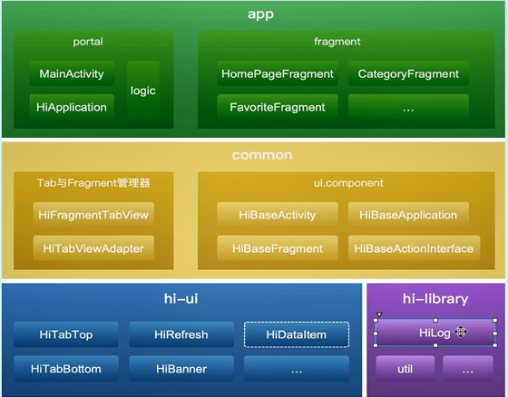

# 通用UI组件与基础框架设计

### 框架设计思想
- 功能模块的高内聚和低耦合
- 面向接口编程
- 易于扩展和维护

App框架图如下  

**HiTabBottom组件开发**
1. 需求分析
   - 提供通用的API
   - 支持设置透明度和底部透出
   - 支持Tab中间高度超过，凸起布局效果
   - 支持icontfont与bitmap
2. 疑难点分析
   - 透明度和底部透出，列表可渲染高度问题
   - 中间高度超过，凸起布局

**Fragment常见问题**  

在开发者选项中如果打开不保留活动选项，那么用户的切后台时Actiity会被销毁(Fragment不会)，重新打开应用后会导致Activity重新创建，此时会重复创建Fragment。  
解决方法：通过Activity的onSaveInstanceState()保存应用状态，解决Fragment重叠问题。

**HiTabTop组件开发**  
1. 需求分析
   - 提供通用的API
   - 支持Text和Bitmap
   - 支持自动滚动
2. 疑难点分析
   - 计算自动滚动距离   

