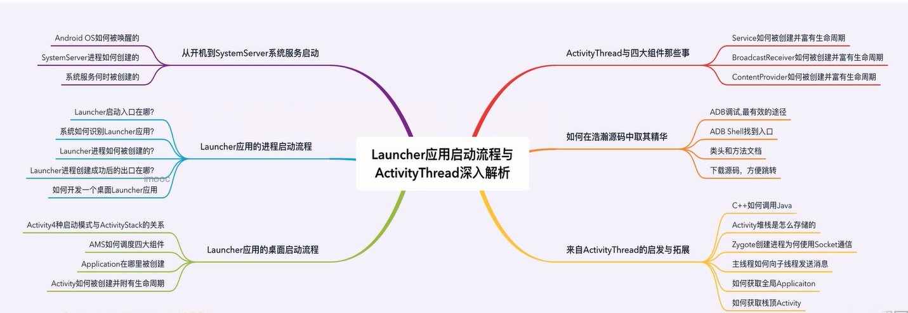
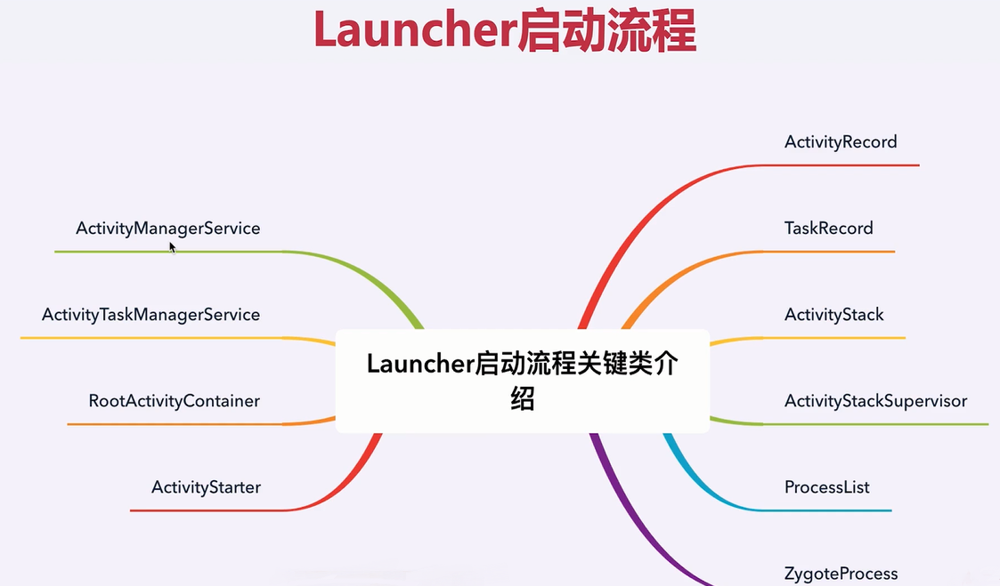
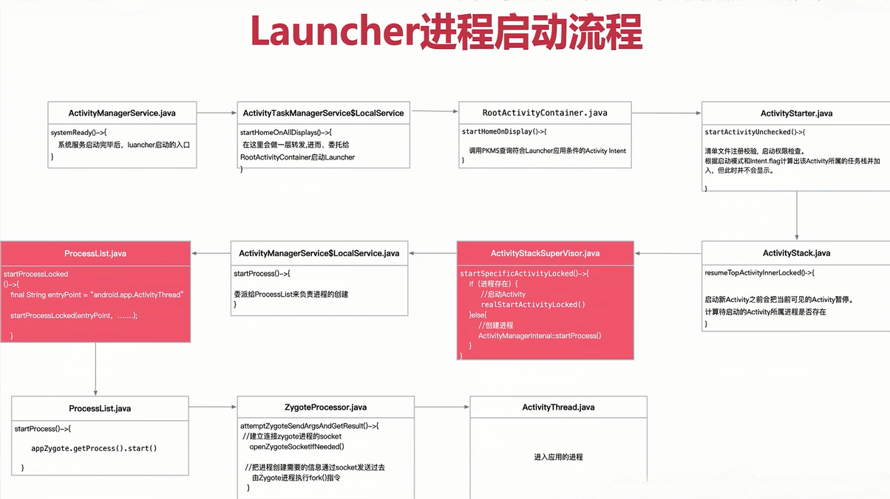
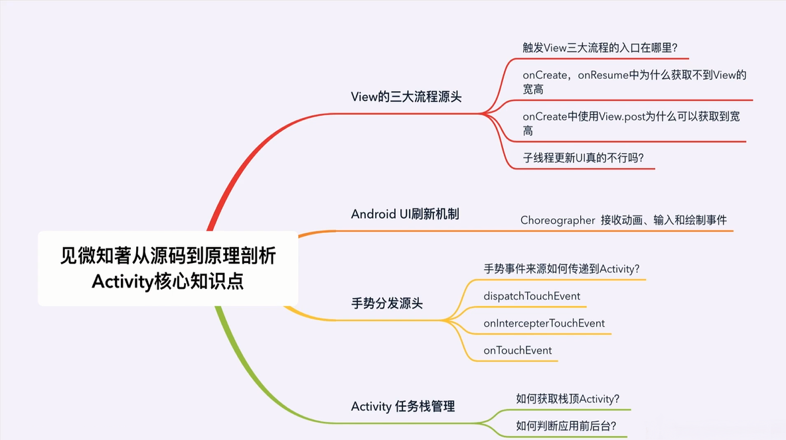
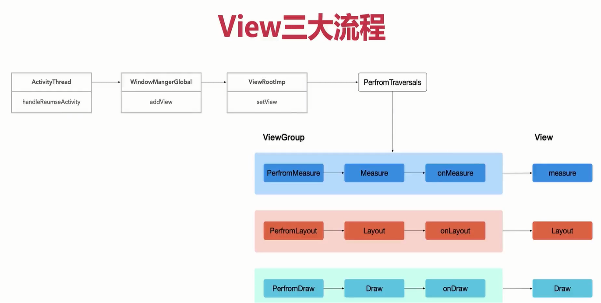
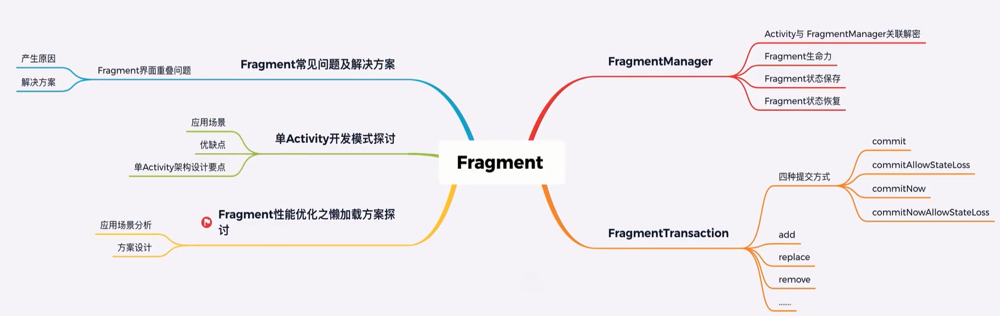

# Android UI核心组件剖析与实战


## 2.1开机到SystemServer进程及服务创建流程剖析




### 来自Launcher应用的启动与拓展
- 1.在分析Zygote进程创建之后，会进入Java世界，ZygoteInit.java。那么如何实现C++转到Java的呢？ Java调用C++方法可以通过JNI调用。C++是如何访问Java实例方法和静态方法


ZygoteInit.java中的main()方法启动SystemServer.java启动不同类型的系统服务，在SystemServer中的startOtherServices()方法中在启动完其他服务后会通知ActivityManagerService调用它的syetemReady()方法就可以启动Launcher应用。


## 2.2 Launcher应用启动之进程启动1




### Activity任务栈模型





### Android10 中Launcher启动过程为如下  
- ActivityManagerService.systemReady() -> ActivityTaskManagerService.startHomeOnAllDisplays() -> RootWindowContainer.startHomeOnDisplay() -> startHomeOnTaskDisplayArea() -> ActivityStartController.startHomeActivity() -> ActivityStarter.startActivity()

```java
    // ActivityStartController.java
    void startHomeActivity(Intent intent, ActivityInfo aInfo, String reason) {
        mSupervisor.moveHomeStackTaskToTop(reason);

        mLastHomeActivityStartResult = obtainStarter(intent, "startHomeActivity: " + reason)
                .setOutActivity(tmpOutRecord)
                .setCallingUid(0)
                .setActivityInfo(aInfo)
                //在ActivityStarter中启动Activity
                .execute();
        mLastHomeActivityStartRecord = tmpOutRecord[0];
        if (mSupervisor.inResumeTopActivity) {
            mSupervisor.scheduleResumeTopActivities();
        }
    }
```

## 2.3 Launcher应用启动之进程启动2
## 2.4 Launcher应用启动之ActivityThread源码分析

### ActivityThread结构图如下  


### Java设计模式之状态机模式  
<br> 

 > 状态模式的思想是将状态以及状态间的转换规则（状态机）和状态对应的特性行为封装成为一个对象，使用该对象装配环境类（context），以达到进行状态切换的时候能够自动变更context的某些行为（context的行为主要依靠状态的行为）

<br> 

## 3.1 Activity之View树测绘流程分析-1



### 如何在Activity中获取View的宽和高?  
<br/>

- View.post(Runnable action)
- View.getViewTreeObserver().addOnGlobalLayoutListener(OnGlobalLayoutListener listener) 可能回调多次

### View的测绘流程的入口?

ActivityThread.handleResumeActivity() -> WindowManagerGlobal.addView() -> ViewRootImpl.setView() -> ViewRootImpl.performTraversals() 

## 3.2 Activity之View树测绘流程分析-2
### ViewRootImpl的相关功能


### 在子线程中更新UI是否一定会抛出异常(Only the original thread that created a view hierarchy can touch its views.)?  
<br/>

### 在ViewRootImpl执行scheduleTraversals()方法时会使用到消息屏障  

```java
    void scheduleTraversals() {
        if (!mTraversalScheduled) {
            // 过滤
            mTraversalScheduled = true;
            // 插入同步消息屏障  让异步消息先执行
            mTraversalBarrier = mHandler.getLooper().getQueue().postSyncBarrier();
            // 异步执行mTraversalRunnable
            mChoreographer.postCallback(
                    Choreographer.CALLBACK_TRAVERSAL, mTraversalRunnable, null);
            if (!mUnbufferedInputDispatch) {
                scheduleConsumeBatchedInput();
            }
            notifyRendererOfFramePending();
            pokeDrawLockIfNeeded();
        }
    }

    void unscheduleTraversals() {
        if (mTraversalScheduled) {
            mTraversalScheduled = false;
            // 根据序号移除消息屏障
            mHandler.getLooper().getQueue().removeSyncBarrier(mTraversalBarrier);
            mChoreographer.removeCallbacks(
                    Choreographer.CALLBACK_TRAVERSAL, mTraversalRunnable, null);
        }
    }
```

### Handler之消息屏障消息

- Handler消息有同步消息、异步消息、屏障消息
- 屏障消息的设计是为了让异步消息优先执行。从而使得ViewRootImpl中UI测量、布局、绘制尽早来执行





## 3.3 Activity之页面刷新机制概述
<br/>

### [Chroeographer源码分析](https://www.jianshu.com/p/996bca12eb1d/)

### **View的动画也是通过Chroeographer来协调进行的**


## 3.4 Activity之手势分发来源


```java
// 线程调用栈信息Log
W System.err:    at com.ryg.reveallayout.ui.FrameLayoutEx.onTouchEvent(FrameLayoutEx.java:27)
W System.err:    at android.view.View.dispatchTouchEvent(View.java:9294)
W System.err:    at android.view.ViewGroup.dispatchTransformedTouchEvent(ViewGroup.java:2547)
W System.err:    at android.view.ViewGroup.dispatchTouchEvent(ViewGroup.java:2240)
W System.err:    at android.view.ViewGroup.dispatchTransformedTouchEvent(ViewGroup.java:2553)
W System.err:    at android.view.ViewGroup.dispatchTouchEvent(ViewGroup.java:2197)
W System.err:    at android.view.ViewGroup.dispatchTransformedTouchEvent(ViewGroup.java:2553)
W System.err:    at android.view.ViewGroup.dispatchTouchEvent(ViewGroup.java:2197)
W System.err:    at android.view.ViewGroup.dispatchTransformedTouchEvent(ViewGroup.java:2553)
W System.err:    at android.view.ViewGroup.dispatchTouchEvent(ViewGroup.java:2197)
W System.err:    at com.android.internal.policy.PhoneWindow$DecorView.superDispatchTouchEvent(PhoneWindow.java:2403)
W System.err:    at com.android.internal.policy.PhoneWindow.superDispatchTouchEvent(PhoneWindow.java:1737)
W System.err:    at android.app.Activity.dispatchTouchEvent(Activity.java:2765)
W System.err:    at com.android.internal.policy.PhoneWindow$DecorView.dispatchTouchEvent(PhoneWindow.java:2364)
W System.err:    at android.view.View.dispatchPointerEvent(View.java:9514)
W System.err:    at android.view.ViewRootImpl$ViewPostImeInputStage.processPointerEvent(ViewRootImpl.java:4230)
W System.err:    at android.view.ViewRootImpl$ViewPostImeInputStage.onProcess(ViewRootImpl.java:4096)
W System.err:    at android.view.ViewRootImpl$InputStage.deliver(ViewRootImpl.java:3642)
W System.err:    at android.view.ViewRootImpl$InputStage.onDeliverToNext(ViewRootImpl.java:3695)
W System.err:    at android.view.ViewRootImpl$InputStage.forward(ViewRootImpl.java:3661)
W System.err:    at android.view.ViewRootImpl$AsyncInputStage.forward(ViewRootImpl.java:3787)
W System.err:    at android.view.ViewRootImpl$InputStage.apply(ViewRootImpl.java:3669)
W System.err:    at android.view.ViewRootImpl$AsyncInputStage.apply(ViewRootImpl.java:3844)
W System.err:    at android.view.ViewRootImpl$InputStage.deliver(ViewRootImpl.java:3642)
W System.err:    at android.view.ViewRootImpl$InputStage.onDeliverToNext(ViewRootImpl.java:3695)
W System.err:    at android.view.ViewRootImpl$InputStage.forward(ViewRootImpl.java:3661)
W System.err:    at android.view.ViewRootImpl$InputStage.apply(ViewRootImpl.java:3669)
W System.err:    at android.view.ViewRootImpl$InputStage.deliver(ViewRootImpl.java:3642)
W System.err:    at android.view.ViewRootImpl.deliverInputEvent(ViewRootImpl.java:5922)
W System.err:    at android.view.ViewRootImpl.doProcessInputEvents(ViewRootImpl.java:5896)
W System.err:    at android.view.ViewRootImpl.enqueueInputEvent(ViewRootImpl.java:5857)
W System.err:    at android.view.ViewRootImpl$WindowInputEventReceiver.onInputEvent(ViewRootImpl.java:6025)
W System.err:    at android.view.InputEventReceiver.dispatchInputEvent(InputEventReceiver.java:185)
```

## 3.5 Activity之任务栈管理
## 4.1 Fragment之FragmentTraction事务执行流程分析




## 4.2 Fragment之页面重叠与新版懒加载-1

### **Fragment页面重叠解决方案**


### **新版Fragment懒加载实现方式**  

### ViewPager配合FragmentStatePageAdapter && ViewPager2配合FragmentPagerAdpter

## 4.3 Fragment之页面重叠与新版懒加载-2

单Activity开发模式探讨

|                       | 灵活性  | 响应速度| 稳定性 | 拓展性
|  ----                 | ----    |  ----  | ----  |---- |
| 多Activity            | 一般     | 一般   | 高    | 高   |
| 单Activity多Fragment  | 高       | 高     |  低   | 一般 |

## 5.1 RecyclerView家族图谱分析


## 5.2 RecyclerView源码解析
## 5.3 RecyclerView优化之回收复用机制探秘


  

### **RecyclerView四级缓存**  

1. 屏幕内缓存   
    mChangedScrap： 表示数据已经改变的ViewHolder列表，存储 notifXXX 方法时需要改变的 ViewHolder,匹配机制按照position和id进行匹配。  
    mAttachedScrap： 表示未与RecyclerView分离的ViewHolder列表，未与RecyclerView分离的ViewHolder列表，如果仍依赖于 RecyclerView （比如已经滑动出可视范围，但还没有被移除掉），但已经被标记移除的 ItemView 集合会被添加到 mAttachedScrap 中。

2. 屏幕外缓存  
    mCachedViews：当列表滑动出了屏幕时，ViewHolder会被缓存在 mCachedViews，其大小由mViewCacheMax决定，默认DEFAULT_CACHE_SIZE为2，可通过Recyclerview.setItemViewCacheSize()动态设置。
3. 自定义缓存 ViewCacheExtension
4. 缓存池 RecycledViewPool


## 6.1 高易用HiDataItem组件封装之需求分析
## 6.2 高易用HiDataItem组件封装-1

## 6.3 高易用HiDataItem组件封装-2

## 7.1 本周总结