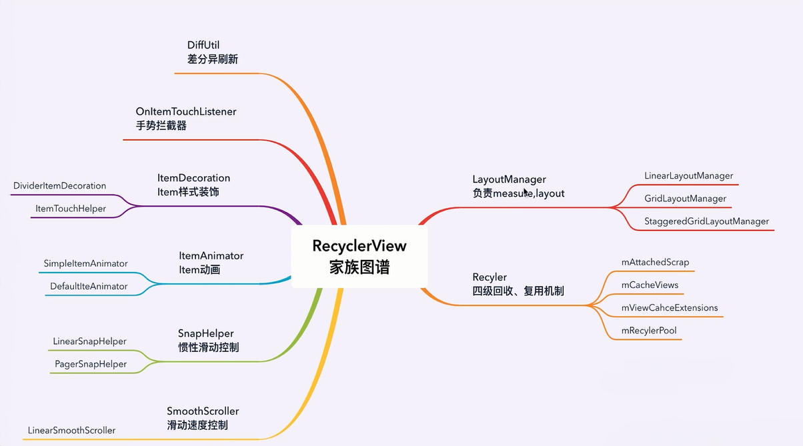

# Android UI核心组件剖析与实战


## 2.1开机到SystemServer进程及服务创建流程剖析


## 2.2 Launcher应用启动之进程启动1


### Android10 中Launcher启动过程为如下  
- ActivityManagerService.systemReady() -> ActivityTaskManagerService.startHomeOnAllDisplays() -> - -RootWindowContainer.startHomeOnDisplay() -> startHomeOnTaskDisplayArea()

```java
 /**
     * This starts home activity on display areas that can have system decorations based on
     * displayId - default display area always uses primary home component.
     * For secondary display areas, the home activity must have category SECONDARY_HOME and then
     * resolves according to the priorities listed below.
     *  - If default home is not set, always use the secondary home defined in the config.
     *  - Use currently selected primary home activity.
     *  - Use the activity in the same package as currently selected primary home activity.
     *    If there are multiple activities matched, use first one.
     *  - Use the secondary home defined in the config.
     */
    boolean startHomeOnTaskDisplayArea(int userId, String reason, TaskDisplayArea taskDisplayArea,
            boolean allowInstrumenting, boolean fromHomeKey) {
        // Fallback to top focused display area if the provided one is invalid.

        Intent homeIntent = null;
        ActivityInfo aInfo = null;
        if (taskDisplayArea == getDefaultTaskDisplayArea()) {
            // 启动Launcher的Intent
            homeIntent = mService.getHomeIntent();
            aInfo = resolveHomeActivity(userId, homeIntent);
        } else if (shouldPlaceSecondaryHomeOnDisplayArea(taskDisplayArea)) {
            Pair<ActivityInfo, Intent> info = resolveSecondaryHomeActivity(userId, taskDisplayArea);
            aInfo = info.first;
            homeIntent = info.second;
        }
        ...
        // 交给ActivityStartController去处理
        mService.getActivityStartController().startHomeActivity(homeIntent, aInfo, myReason,
                taskDisplayArea);
        return true;
    }
```

## 2.3 Launcher应用启动之进程启动2
## 2.4 Launcher应用启动之ActivityThread源码分析

### ActivityThread结构图如下  


### Java设计模式之状态机模式  
<br> 

 > 状态模式的思想是将状态以及状态间的转换规则（状态机）和状态对应的特性行为封装成为一个对象，使用该对象装配环境类（context），以达到进行状态切换的时候能够自动变更context的某些行为（context的行为主要依靠状态的行为）

<br> 

## 3.1 Activity之View树测绘流程分析-1


### 如何在Activity中获取View的宽和高?  
<br/> 

### View的测绘流程的入口?

## 3.2 Activity之View树测绘流程分析-2
### ViewRootImpl的相关功能


### 在子线程中更新UI是否一定会抛出异常(Only the original thread that created a view hierarchy can touch its views.)?  
<br/>

### 在ViewRootImpl执行scheduleTraversals()方法时会使用到消息屏障  

```java
    void scheduleTraversals() {
        if (!mTraversalScheduled) {
            // 过滤
            mTraversalScheduled = true;
            // 插入同步消息屏障  让异步消息先执行
            mTraversalBarrier = mHandler.getLooper().getQueue().postSyncBarrier();
            // 异步执行mTraversalRunnable
            mChoreographer.postCallback(
                    Choreographer.CALLBACK_TRAVERSAL, mTraversalRunnable, null);
            if (!mUnbufferedInputDispatch) {
                scheduleConsumeBatchedInput();
            }
            notifyRendererOfFramePending();
            pokeDrawLockIfNeeded();
        }
    }

    void unscheduleTraversals() {
        if (mTraversalScheduled) {
            mTraversalScheduled = false;
            // 根据序号移除消息屏障
            mHandler.getLooper().getQueue().removeSyncBarrier(mTraversalBarrier);
            mChoreographer.removeCallbacks(
                    Choreographer.CALLBACK_TRAVERSAL, mTraversalRunnable, null);
        }
    }
```

### Handler之消息屏障消息

- Handler消息有同步消息、异步消息、屏障消息
- 屏障消息的设计是为了让异步消息优先执行。从而使得ViewRootImpl中UI测量、布局、绘制尽早来执行


## 3.3 Activity之页面刷新机制概述
<br/>

### [Chroeographer源码分析](https://www.jianshu.com/p/996bca12eb1d/)

### **View的动画也是通过Chroeographer来协调进行的**


## 3.4 Activity之手势分发来源


## 3.5 Activity之任务栈管理
## 4.1 Fragment之FragmentTraction事务执行流程分析


## 4.2 Fragment之页面重叠与新版懒加载-1

### *Fragment页面重叠解决方案*  


### *新版Fragment懒加载实现方式*  
### ViewPager配合FragmentStatePageAdapter && ViewPager2配合FragmentPagerAdpter

## 4.3 Fragment之页面重叠与新版懒加载-2


## 5.1 RecyclerView家族图谱分析



## 5.2 RecyclerView源码解析
## 5.3 RecyclerView优化之回收复用机制探秘


  

### **RecyclerView四级缓存**  

1. 屏幕内缓存   
    mChangedScrap： 表示数据已经改变的ViewHolder列表，存储 notifXXX 方法时需要改变的 ViewHolder,匹配机制按照position和id进行匹配。  
    mAttachedScrap： 表示未与RecyclerView分离的ViewHolder列表，未与RecyclerView分离的ViewHolder列表，如果仍依赖于 RecyclerView （比如已经滑动出可视范围，但还没有被移除掉），但已经被标记移除的 ItemView 集合会被添加到 mAttachedScrap 中。

2. 屏幕外缓存  
    mCachedViews：当列表滑动出了屏幕时，ViewHolder会被缓存在 mCachedViews，其大小由mViewCacheMax决定，默认DEFAULT_CACHE_SIZE为2，可通过Recyclerview.setItemViewCacheSize()动态设置。
3. 自定义缓存 ViewCacheExtension
4. 缓存池 RecycledViewPool


## 6.1 高易用HiDataItem组件封装之需求分析
## 6.2 高易用HiDataItem组件封装-1

## 6.3 高易用HiDataItem组件封装-2

## 7.1 本周总结