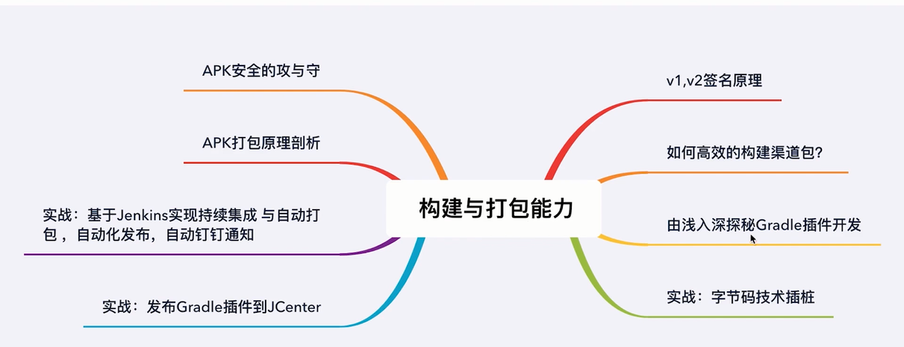
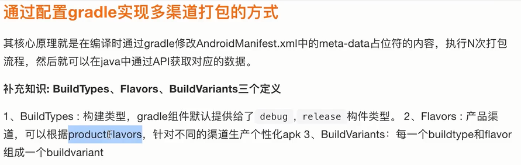
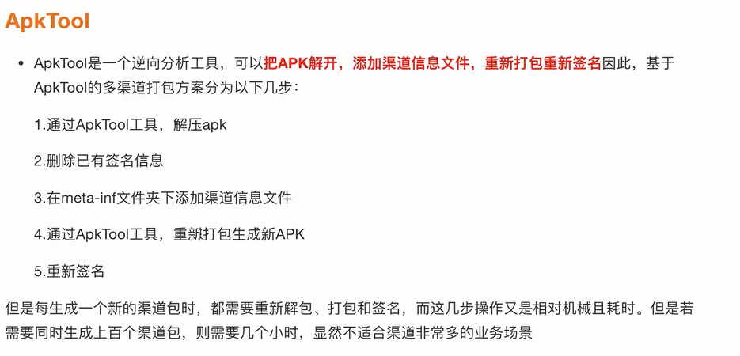
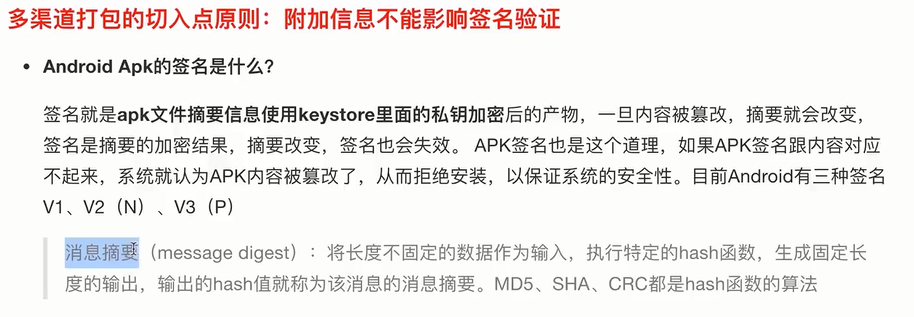
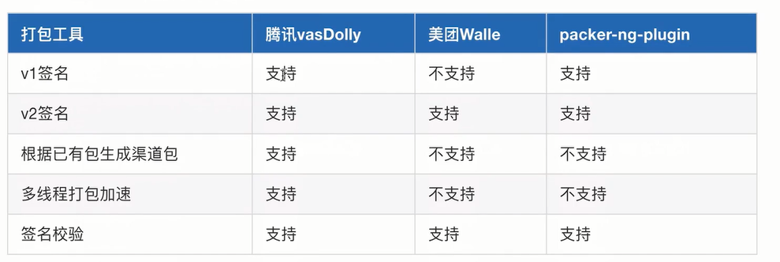
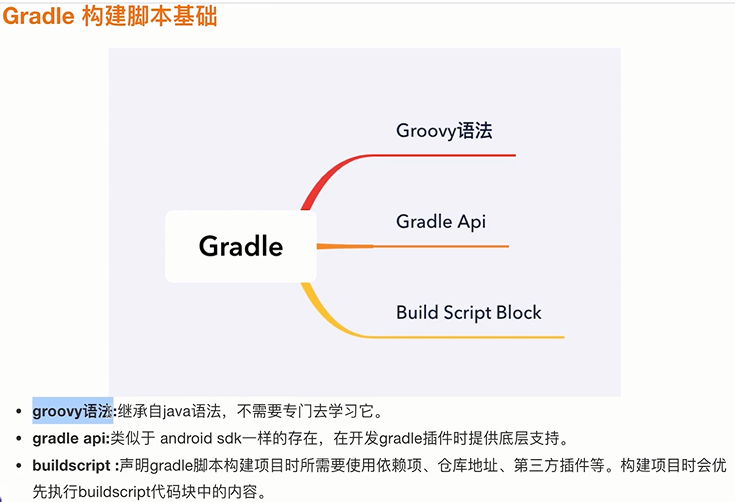

# 构建与打包能力

## 2.1 高效构建渠道包-1

### 如何高效的构建渠道包?
- 什么是多渠道
- 为什么要提供多渠道包
- gradle实现多渠道打包
- V1打包签名原理概述
- V2打包签名原理概述
- 商用多渠道打包方式实战

什么是多渠道包？   
渠道包就是需要在安装包apk中添加渠道信息，也就是channel，对应不同的渠道，例如小米市场、360市场等，需要为每个apk包设定一个可以区分渠道的标识，这个为apk包设定应用市场标识的过程就是多渠道打包。

为什么要提供多渠道包？  
国内存在着有众多的应用市场，产品在不同的渠道可能又不同的统计需求，为此Android开发人员需要为每个应用市场发布一个安装包，在安装包中添加不同的标识，应用在请求网络的时候携带渠道信息，方便后台做运营统计。

gradle实现多渠道打包方式？ 

gradle多渠道打包的缺点？
- 每生成一个渠道包，都要重新执行一遍构建流程，效率太低，只适用于渠道较少的场景
- Gradle会为每个渠道包生成一个不同的BuildConfig.java类，记录渠道信息，导致每个渠道包的dex文件的CRC值不用，在使用Tinker热修复时较为麻烦

## 2.2 高效构建渠道包-2

## 3.1 Gradle构建项目基础

### 深入浅出Gradle插件开发
- Gradle构建生命周期
- Gradle Project工程树
- 自定义Task
- 自定义插件Transform
- 字节码插桩技术

