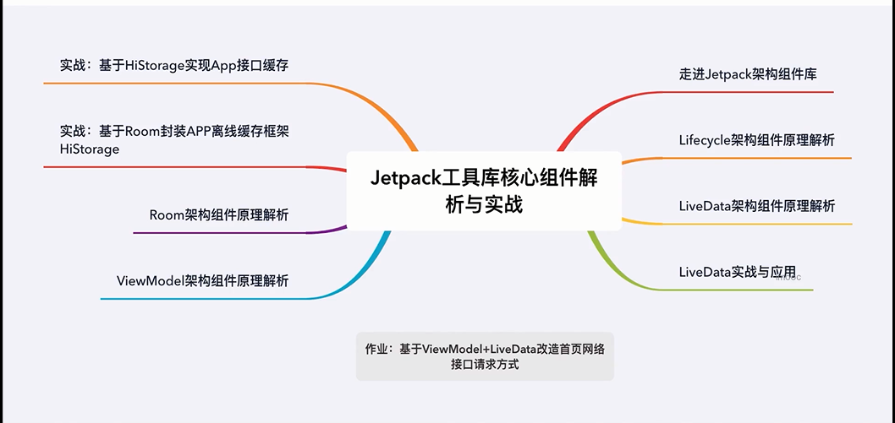
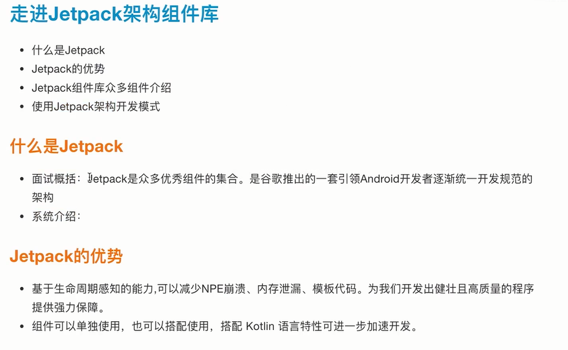
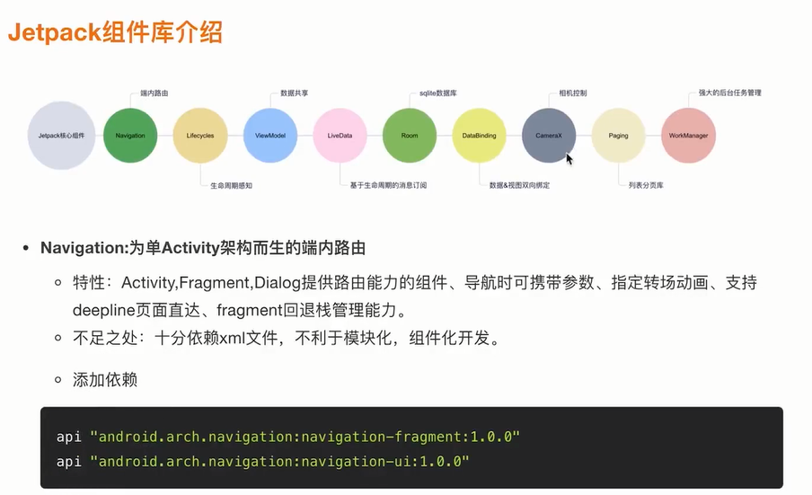
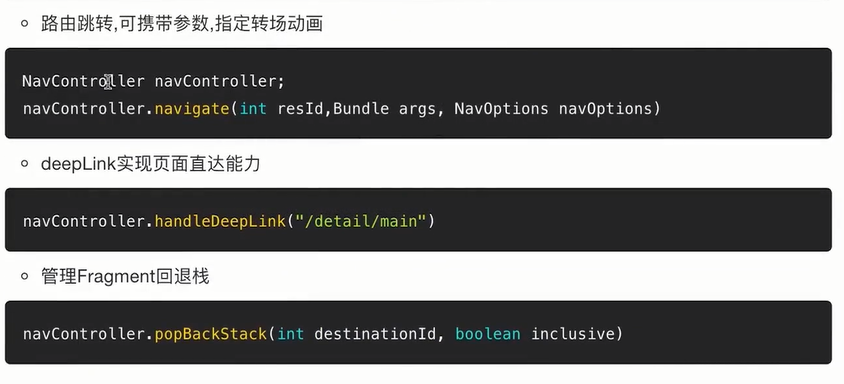
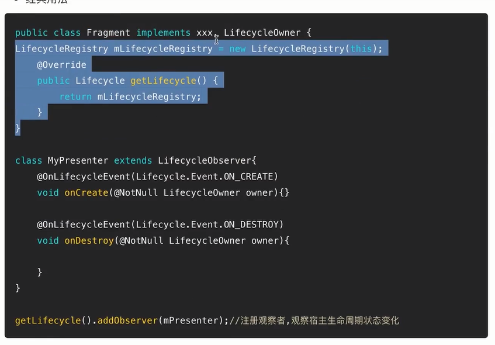
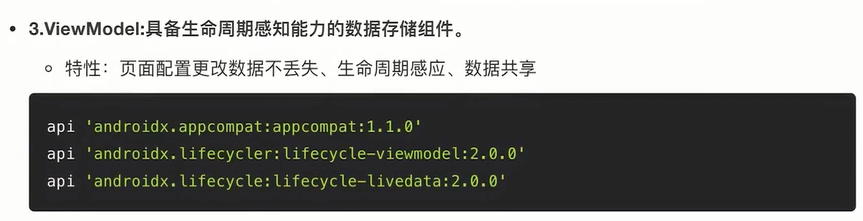
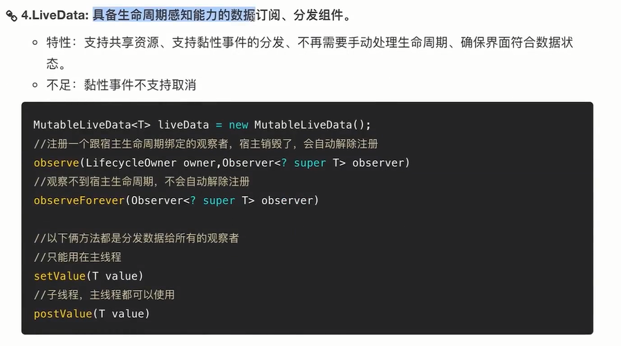

# 解密Jectpack工具库核心组件

## 1.1 本周目标

 

## 2.1 走进Jectpack架构

 
 
 
 
 

 

### ViewModel数据存储、生命周期感知能力
### ViewModel在单Activity多Fragment下的数据共享能力

### 5.Room: 轻量级orm数据库，本质上是一个SQLite抽象层

 - 特性：使用更加简单，通过注解的方式实现相关功能。编译时自动生成实现Impl
 - 引入依赖
 - 数据库读写

### 6.DataBinding: 解决View和数据之间的双向绑定。MVVM是一种架构模式，二者有明显区别。
- 特性：数据与视图双向绑定、数据绑定空安全、减少模板代码、释放Activity/Fragment
- 开启dataBinding
- 布局中绑定数据

## 2.2 Jetpack架构组件库解析

## 3.1 Lifecycle组件架构实现原理-1

## 3.2 Lifecycle组件架构实现原理-2

## 4.1 LiveData组件架构实现原理

## 4.2 实战：实现不用反注册,不会内存泄露的消息总线

## 5.1 ViewModel实例复用原理新解析

## 5.2 SavedState组件数据存储与复用原理全解析

## 6.1 Room数据库高频用法讲解-1

## 6.2 Room数据库高频用法讲解-2

## 6.3 Room+LiveData监听数据库数据变更刷新页面原理分析
