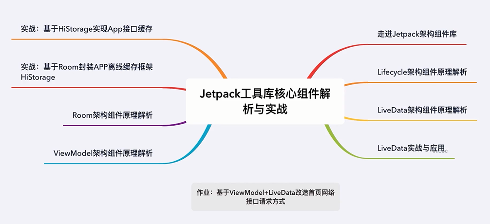
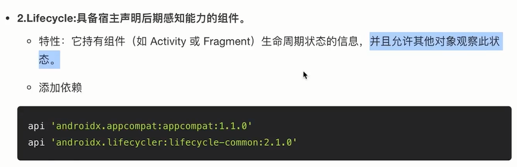

# 解密Jectpack工具库核心组件

## 1.1 本周目标

 

## 2.1 走进Jectpack架构

 
 
 
 
 

 

### ViewModel数据存储、生命周期感知能力
### ViewModel在单Activity多Fragment下的数据共享能力

## 2.2 Jetpack架构组件库解析

### 5.Room: 轻量级orm数据库，本质上是一个SQLite抽象层

 - 特性：使用更加简单，通过注解的方式实现相关功能。编译时自动生成实现Impl
 - 引入依赖
 - 数据库读写

### 6.DataBinding: 解决View和数据之间的双向绑定。MVVM是一种架构模式，二者有明显区别。
- 特性：数据与视图双向绑定、数据绑定空安全、减少模板代码、释放Activity/Fragment
- 开启dataBinding
- 布局中绑定数据

### 7.WorkManager：新一代后台任务管理组件，功能十分强大。Service能做的事情它都能做。

- 支持周期性任务调度、链式任务调度、丰富的任务约束条件、即便程序退出依旧保证任务执行。
- 使用工作约束明确定义工作运行的最佳条件
- WorkManager 允许您使用灵活的调度窗口调度工作，以运行一次性或重复工作
- 有时工作会失败。WorkManager 提供了灵活的重试政策，包括可配置的指数退避政策

### 8.Paging: 列表分页组件，可以轻松完成分页预加载以达到无限滑动的效果

- 分页数据的内存中缓存。该功能可确保您的应用在处理分页数据时高效利用系统资源
- 内置的请求重复信息删除功能，可确保您的应用高效利用网络带宽和系统资源。
- 可配置的 RecyclerView 适配器，会在用户滚动到已加载数据的末尾时自动请求数据
- 对 Kotlin 协程和 Flow 以及 LiveData 和 RxJava 的一流支持。
- 内置对错误处理功能的支持，包括刷新和重试功能。
- 不足之处，不支持列表数据增删改查

## 3.1 Lifecycle组件架构实现原理-1

## 3.2 Lifecycle组件架构实现原理-2

## 4.1 LiveData组件架构实现原理

## 4.2 实战：实现不用反注册,不会内存泄露的消息总线

## 5.1 ViewModel实例复用原理新解析

## 5.2 SavedState组件数据存储与复用原理全解析

## 6.1 Room数据库高频用法讲解-1

## 6.2 Room数据库高频用法讲解-2

## 6.3 Room+LiveData监听数据库数据变更刷新页面原理分析
