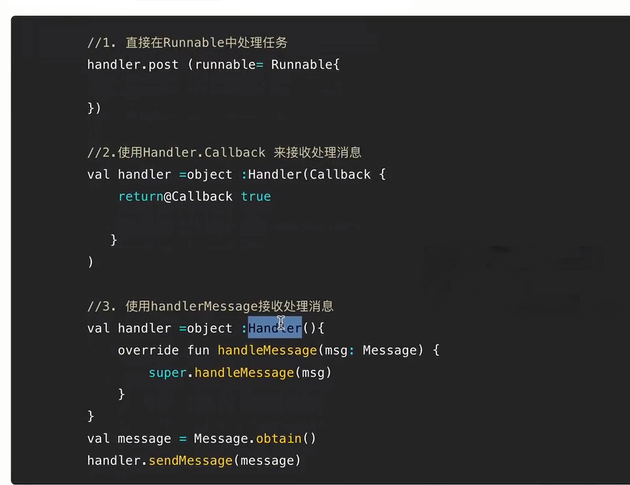
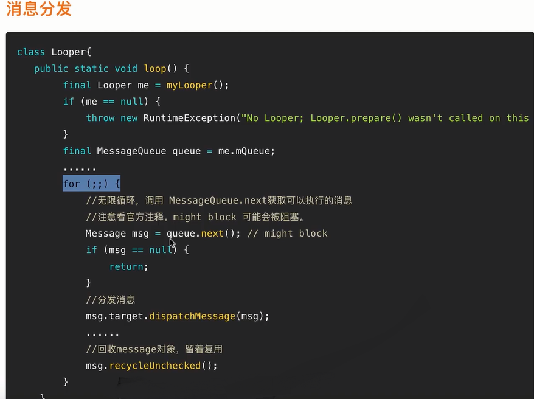
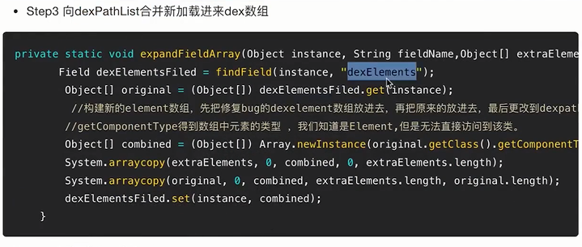

# Android消息机制与类加载

## 2.1 Android消息机制之消息生产

 
 
 
 
 
 
 

 ## 2.2 Android消息机制之消息生产

 
 

## 2.3 Android消息机制之消息消费

 
 
 
 

## 2.4 Android消息机制之ThreadLocal

 
 
 
 
 

## 3.1 Android类加载之双亲委派

### 深入理解Android类加载机制

- 什么是双亲委派
- 双亲委派下的Class文件加载流程
- Android中主要的类加载器
- PathClassLoader & DexClassLoader到底有何异同
- Class文件不同的加载方式
- Class文件加载源码分析

 
 
 
 
 
 

## 3.2 Android类加载之高频面试题

 

## 4.1 走进Android热修复世界1

 
 
 
 
 
 

## 4.2 走进Android热修复世界2
## 5.1 实战：主项目接入Tinker

## 6.1 Tinker实现原理之补丁全量合成流程分析

 
 
 

## 6.2 Tinker实现原理之补丁全量合成流程分析-2
## 6.3 Tinker实现原理分析之动态加载dex实现热修复流程分析

