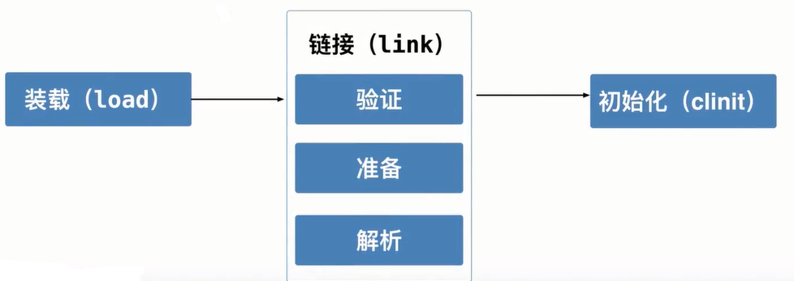
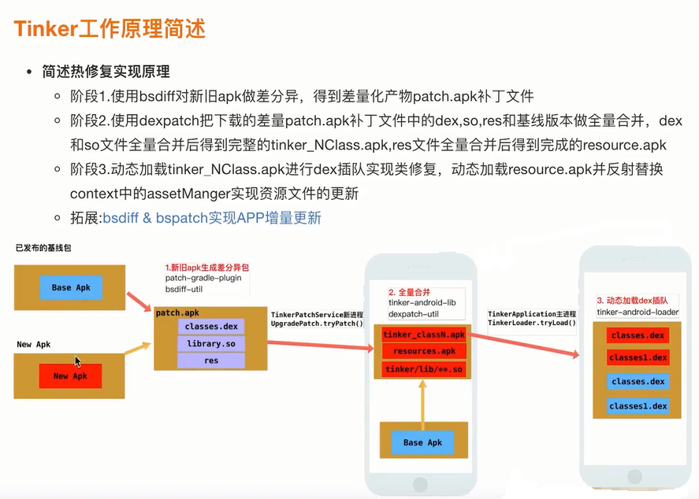

# Android消息机制与类加载

## 2.1 Android消息机制之消息生产

 
 
 
 
 
 
 

 ## 2.2 Android消息机制之消息生产

 
 

## 2.3 Android消息机制之消息消费

 
 
 
 

## 2.4 Android消息机制之ThreadLocal

 
 
 
 
 

## 3.1 Android类加载之双亲委派

### 深入理解Android类加载机制

- 什么是双亲委派
- 双亲委派下的Class文件加载流程
- Android中主要的类加载器
- PathClassLoader & DexClassLoader到底有何异同
- Class文件不同的加载方式
- Class文件加载源码分析

 
 
 
 
 
 

## 3.2 Android类加载之高频面试题
### Class文件加载
类加载指的是将类的.class文件中的二进制数据读入到内存中，将其放在运行时数据区的方法区内，然后在堆区创建一个java.lang.Class对象，用来封装类在方法区内的数据结构，并且提供了访问方法区内的数据结构的方法。
- 通过Class.forName()方法动态加载
- 通过ClassLoader.loadClass()方法动态加载

类加载分为三个步骤 1.装载(Load) 2.链接(Link) 3.初始化(Initialize)

 

## 4.1 走进Android热修复世界1

 
 
 
 
 
 

## 4.2 走进Android热修复世界2
## 5.1 实战：主项目接入Tinker

## 6.1 Tinker实现原理之补丁全量合成流程分析

### Tinker实现原理剖析
- Tinker工作原理说明
- 差量包全量合成与dex2oat在10.0的适配原理
- 全量包动态加载与版本适配原理

 

- 增量升级
  - 增量升级是以两个应用版本之间的差异来生成补丁的，所以必须对所发布的每一个线上版本都和最新的版本做差分，以便所有版本的用户都可以差分升级
  - 增量升级成功的前提是，用户手机端必须存在完整的apk文件。如果运行时无法获取已安装的apk文件，则无法进行增量升级，如果已安装apk内容有过修改(破解版apk)，这样无法进行增量升级，为了防止补丁合成错误，最好通过md5等进行完整性校验，对patch包和已安装包进行完整性和一致性的校验。

## 6.2 Tinker实现原理之补丁全量合成流程分析-2
## 6.3 Tinker实现原理分析之动态加载dex实现热修复流程分析

