# 线程与线程池核心技术

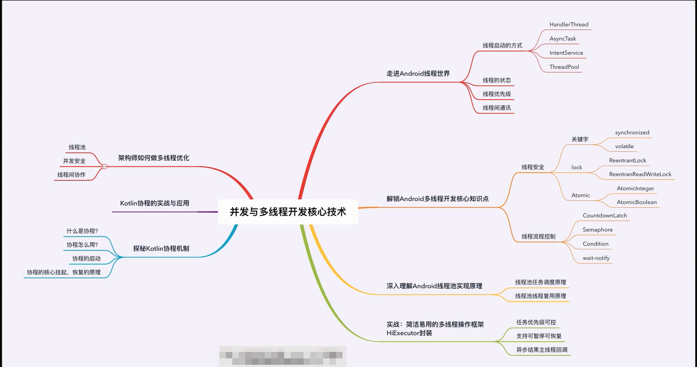  

## 2.1 多种线程创建方式与对比
  
  
  
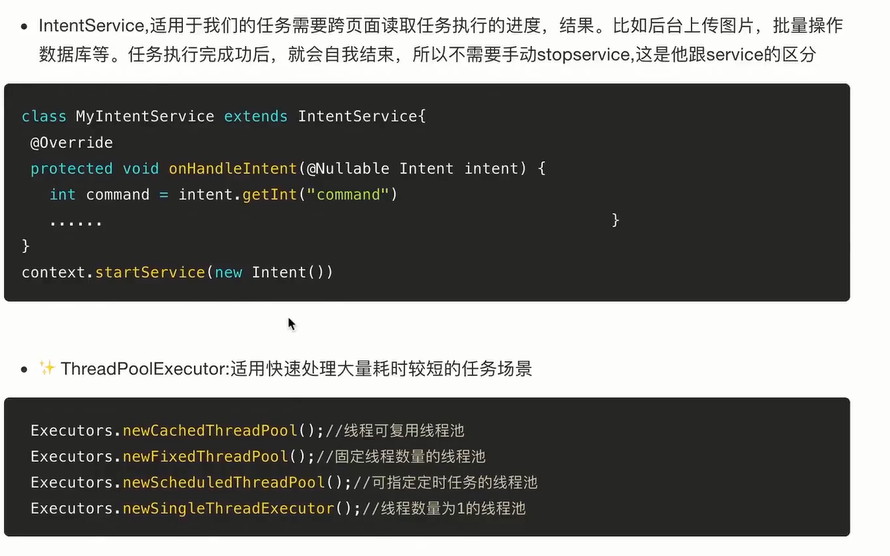   
 
## 2.2 线程优先级核心及应用技巧

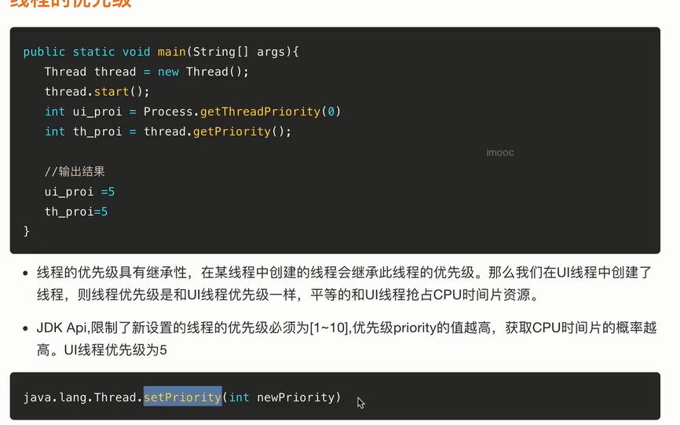  
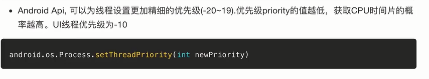   

## 2.3 线程状态剖析及四种方法应用

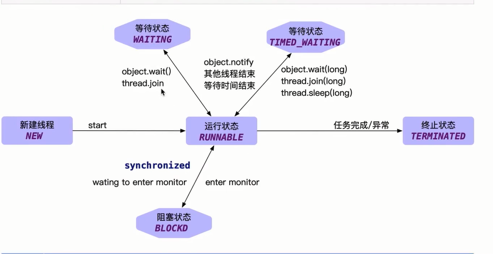   
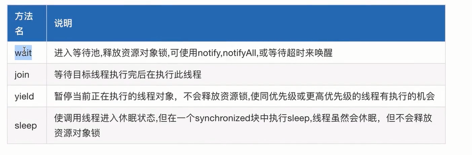   

## 2.4 线程间通讯核心

## 3.1 线程安全的本质

   
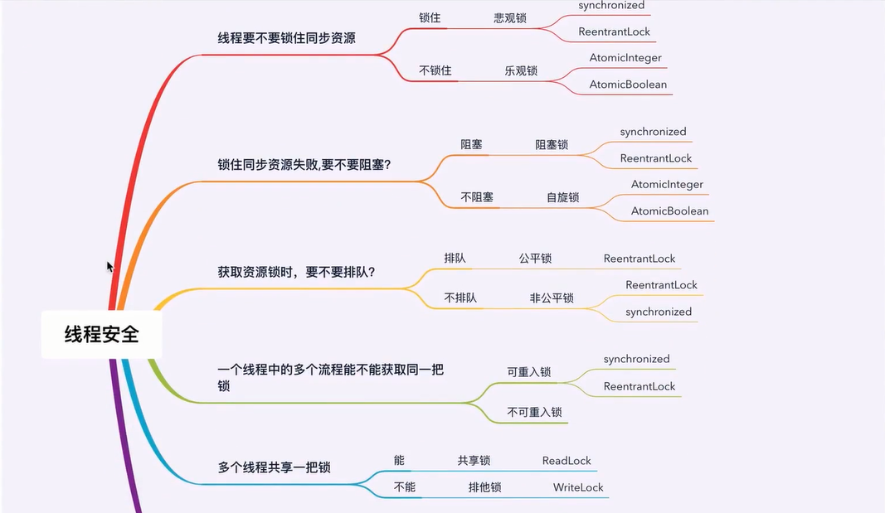   
   
   

## 3.2 线程安全之原子类
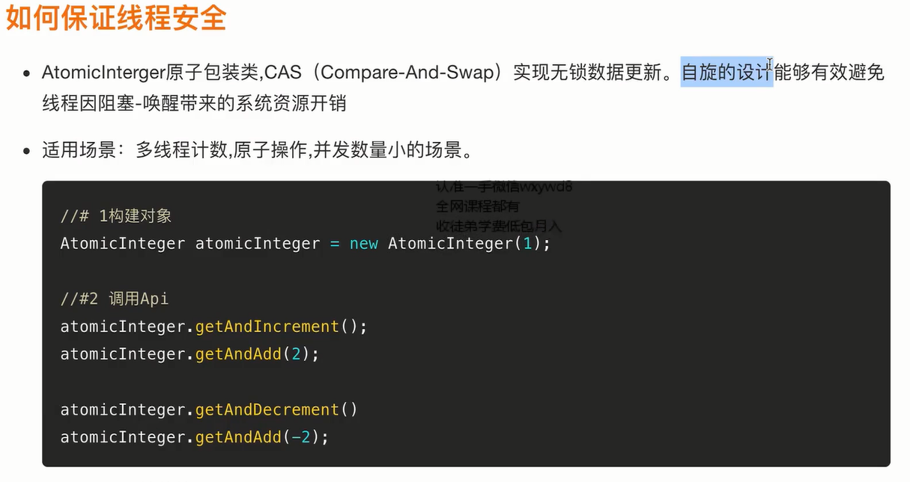   
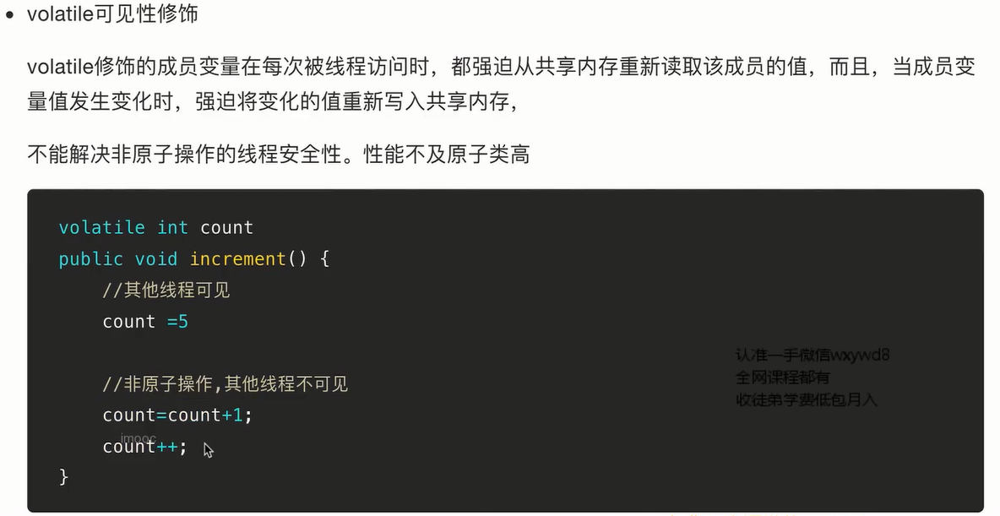  

## 3.3 线程安全之Synchronized
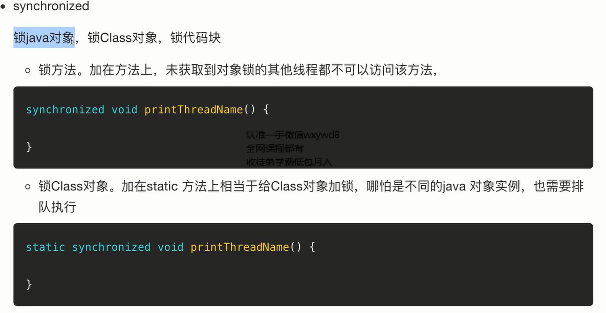   
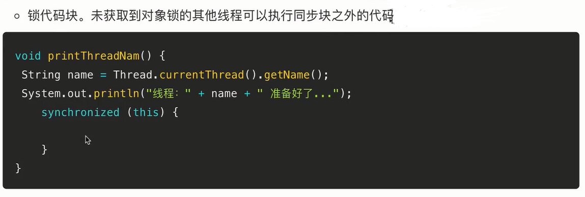   

## 3.4 线程安全之ReentrantLock案例详解

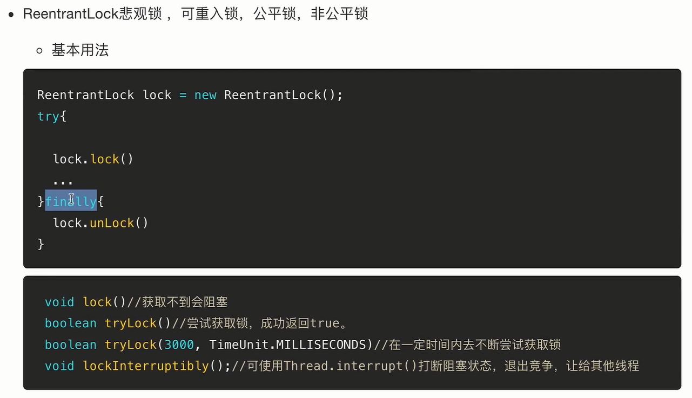 

