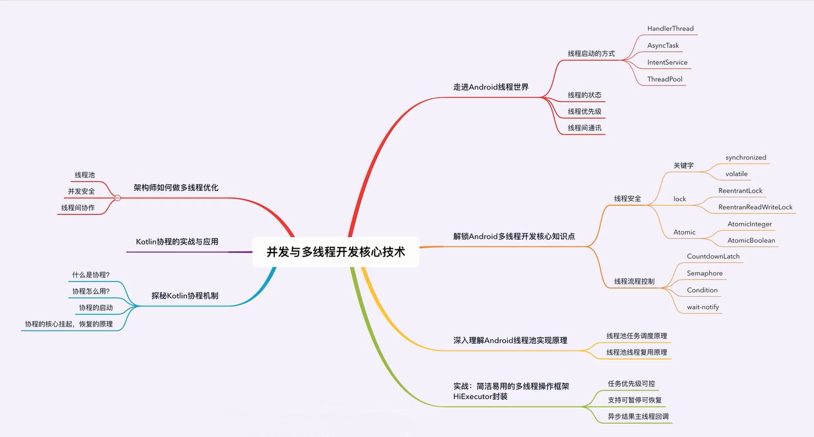

# 线程与线程池核心技术

  

## 2.1 多种线程创建方式与对比
  
  
  
   
 
## 2.2 线程优先级核心及应用技巧

  
   

## 2.3 线程状态剖析及四种方法应用

   
   

## 2.4 线程间通讯核心

## 3.1 线程安全的本质

   
   
   
   

## 3.2 线程安全之原子类
   
  

## 3.3 线程安全之Synchronized
   
   

## 3.4 线程安全之ReentrantLock案例详解

 
 
 

 

## 3.5 线程安全之共享锁排他锁及锁的设计优化

 
 
 
 

## 4.1 线程池实现原理剖析
 
 
 
 
 
 

## 4.2 线程池源码分析

## 4.3 线程池中线程复用原理

## 6.1 大白话剖析Kotlin协程机制1
 
 
 
 
 
 

## 6.2 大白话剖析Kotlin协程机制2

 
 

 
 
 
 

## 6.3 Kotlin协程之挂起与恢复原理逆向剖析还原1

 
 
 

## 6.4 Kotlin协程之挂起与恢复原理逆向剖析还原2
 

 

## 6.5 Kotlin协程应用
## 7.1 架构师如何做多线程优化

