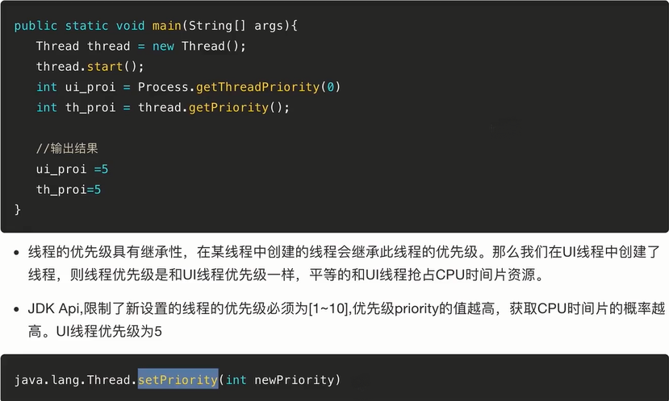
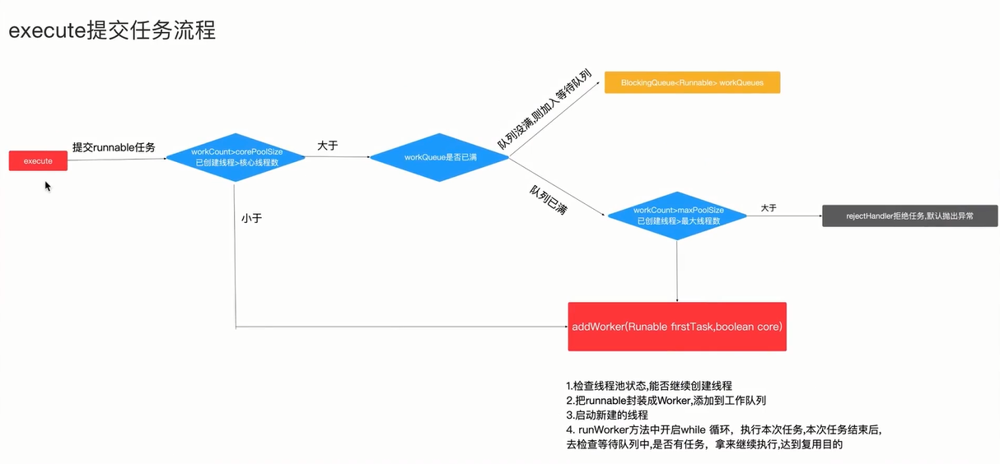

# 线程与线程池核心技术

  

## 2.1 多种线程创建方式与对比
### 线程与进程
- 一个进程至少一个线程
- 进程可以包含多个线程
- 进程在执行过程中拥有独立的内存空间，而线程运行在进程内

### 线程的创建方式
- new Thread() 传递Runnable对象、重写run方法
  - 缺乏统一的管理
- AsyncTask 轻量级的异步任务工具类，可以提供任务执行进度回调给UI线程
  - 场景 需要知道任务执行的进度，多个任务串行执行
  - 缺点 生命周期和宿主的声明周期不同步，可能会发生内存泄露
- HandlerThread 适用于主线程需要和工作线程通信，适用于持续性任务，比如轮询的场景，任务串行执行    
  - 不会像普通线程一样销毁资源，会一直运行，所以可能造成内存泄露

- IntentService 适用于任务需要跨页面读取任务执行的进度

- ThreadPoolExecutor 线程池

``` java
 Executors.newCachedThreadPool(); // 线程可复用
 Executors.newFixedThreadPool(); //固定线程数量
 Executors.newScheduledThreadPool();// 执行定时任务
 Executors.newSingleThreadPool();// 线程数量为1
```  
 
## 2.2 线程优先级核心及应用技巧

  
   

## 2.3 线程状态剖析及四种方法应用

   
   


## 2.4 线程间通讯核心

## 3.1 线程安全的本质

   
   
   
   

## 3.2 线程安全之原子类

### 如何保证线程安全

- AtomInteger原子包装类 CAS 实现无所数据更新。自旋的设计能够有效避免线程因阻塞-唤醒带来的系统资源开销
- 适用场景：对线程计数，原子操作，并发数量小的场景。

- volatile可见性修饰  
 volatile修饰的成员变量在每次被线程访问时，都强迫从共享内存重新读取该成员的值，而且当成员变量发生变化时，强迫将变化的值重新写入共享内存  
 不能解决非原子操作(eg. value++)的线程安全性。性能不如原子类高。

## 3.3 线程安全之Synchronized

### synchronized 锁对象，锁Class对象，锁代码块
 - 锁方法，加在方法上，未获取到对象所的其他线程都不可以访问该方法

``` java
    synchronized void printThreadName(){

    }
```
 - 锁Class对象 加在static方法上相当于给Class对象加锁，哪怕是不用的java对象实例，也需要排队执行
 ``` java
    static synchronized void printThreadName(){

    }
 ```
 - 锁代码块 未获取到对象锁的其他线程可以执行同步块之外的代码

 ```java
    void printThreadName(){
        synchronized(this){

        }
    }
 ```

## 3.4 线程安全之ReentrantLock案例详解

 
 
 

 

## 3.5 线程安全之共享锁排他锁及锁的设计优化

 
 
 
 

## 4.1 线程池实现原理剖析
 
 
 
 
 
 

## 4.2 线程池源码分析

## 4.3 线程池中线程复用原理

## 6.1 大白话剖析Kotlin协程机制1
 
 
 
 
 
 

## 6.2 大白话剖析Kotlin协程机制2

 
 

 
 
 
 


## 6.3 Kotlin协程之挂起与恢复原理逆向剖析还原1

 
 
 


## 6.4 Kotlin协程之挂起与恢复原理逆向剖析还原2
 

 


## 6.5 Kotlin协程应用
## 7.1 架构师如何做多线程优化


