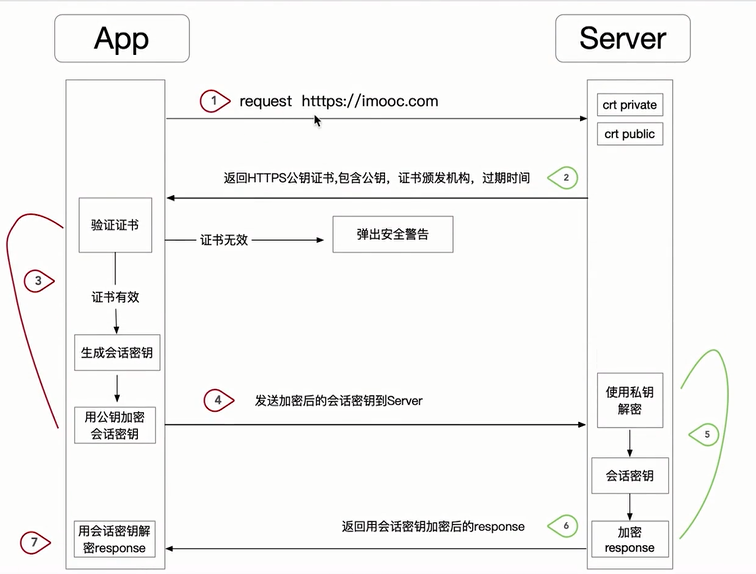

# Android网络编程进阶

  
  
  
  
  


## 4.1 从源码到原理剖析Retrofit核心


### Retrofit概述

- retrofit最简单的使用
``` kotlin
    var retrofit = Retrofit.Builder()
        .baseUrl("https://api.github.com")
        .build();

    interface Api{

        // 默认情况下返回类型为Call<ResponseBody>
        @Get("/user")
        fun login(): Call<ResponseBody>
    }        

```
- retrofit扩展

``` kotlin
var retrofit  = Retrofit.Builder()
     .baseUrl("https://api.github.com")
     .callFactory(OkHttpClient())
     .addConverterFactory(GsonConvertFactory.create())
     .addCallAdapterFactory(RxJavaCallAdapterFactory.create())
     .build()

interface Api{
     @Get("/user")
     fun login(): Call<User>

     @Get("/user")
     fun login1(): Observable<User>

     @Get("/user")
     suspend fun login2(): Response<User>

     @Get("/user")
     suspend fun login3(): User

}
```


